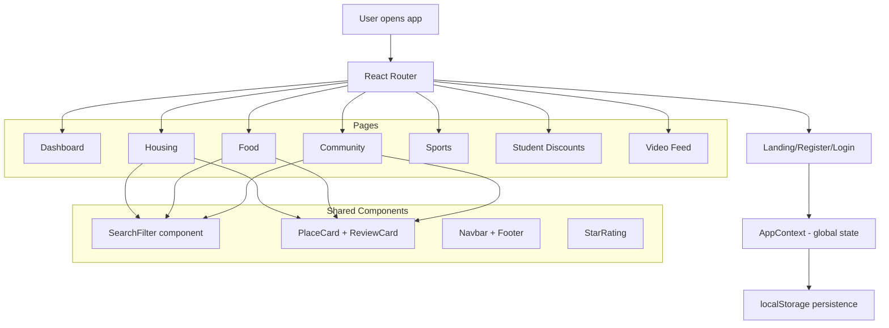

# StudentNest

A complete settlement guide for international students moving to a new country for studies.

## What It Does

StudentNest helps international students find everything they need when arriving at a new city for college:

- **Affordable Housing** — Verified apartments and rooms near campus with real pricing, reviews, and direct landlord contacts
- **Home Food & Groceries** — Restaurants and grocery stores serving your national cuisine, with student discounts
- **Community Groups** — Connect with students from your country, join cultural events and festivals
- **Sports & Activities** — Find pickup games, sports leagues, and fitness groups near campus

## architecture



## how it works

1. Register with your name, email, college, and nationality
2. App loads listings based on your college location
3. Browse housing, food, communities, sports, discounts, and videos
4. Search and filter across all categories
5. Reviews and ratings from other students

## Tech Stack

- **Frontend**: React 18 + Vite
- **Routing**: React Router v7
- **Icons**: Lucide React
- **Animations**: Framer Motion
- **Styling**: Custom CSS design system (no framework dependency)
- **State**: React Context API + localStorage persistence

## Getting Started

```bash
# Install dependencies
npm install

# Start development server
npm run dev

# Build for production
npm run build

# Preview production build
npm run preview
```

## Project Structure

```
src/
├── components/       # Reusable UI components
│   ├── Navbar.jsx
│   ├── Footer.jsx
│   ├── PlaceCard.jsx
│   ├── ReviewCard.jsx
│   ├── StarRating.jsx
│   └── SearchFilter.jsx
├── context/          # Global state management
│   └── AppContext.jsx
├── pages/            # Route pages
│   ├── Landing.jsx
│   ├── Register.jsx
│   ├── Login.jsx
│   ├── Dashboard.jsx
│   ├── Housing.jsx
│   ├── Food.jsx
│   ├── Community.jsx
│   ├── Sports.jsx
│   ├── VideoFeed.jsx
│   ├── StudentDiscounts.jsx
│   └── SettlementGuide.jsx
├── utils/            # Data generation and helpers
│   └── mockData.js
├── App.jsx           # Root component with routing
├── main.jsx          # Entry point
└── index.css         # Global styles and design system
```

## Features

- Responsive design — works on mobile, tablet, and desktop
- Protected routes — dashboard pages require registration
- Student ID system — register once, sign in anywhere with your ID
- Search and filter — find exactly what you need across all categories
- Reviews and ratings — real feedback from other international students
- Contact information — direct phone numbers and emails for every listing
- Upcoming events — see what's happening in community groups and sports clubs

## Deployment

This app can be deployed to any static hosting platform:

- **Netlify**: Connect your repo and set build command to `npm run build`, publish directory to `dist`
- **Vercel**: Import project and it auto-detects Vite configuration
- **GitHub Pages**: Build and deploy the `dist` folder

## Deployment Link:
-https://studentnestgenzy.netlify.app/

